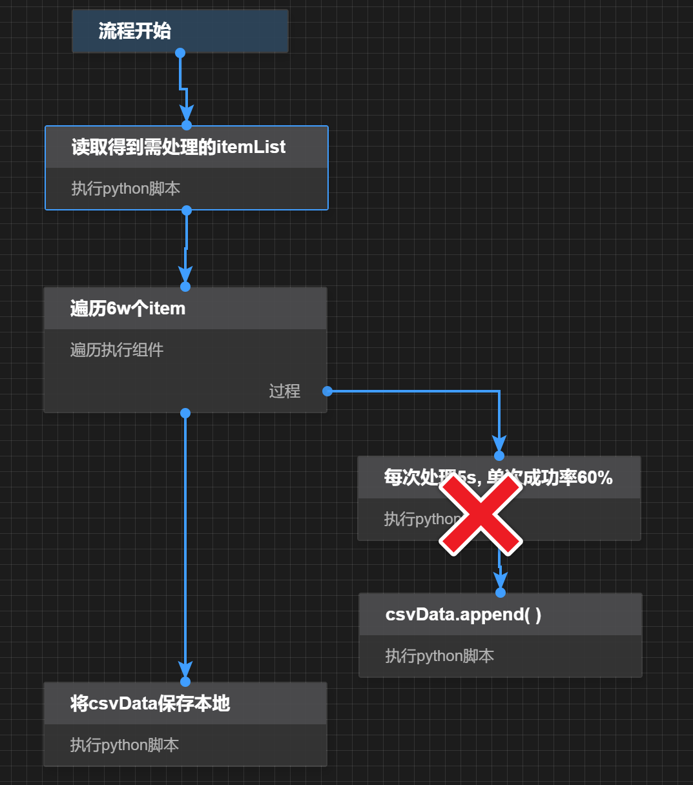
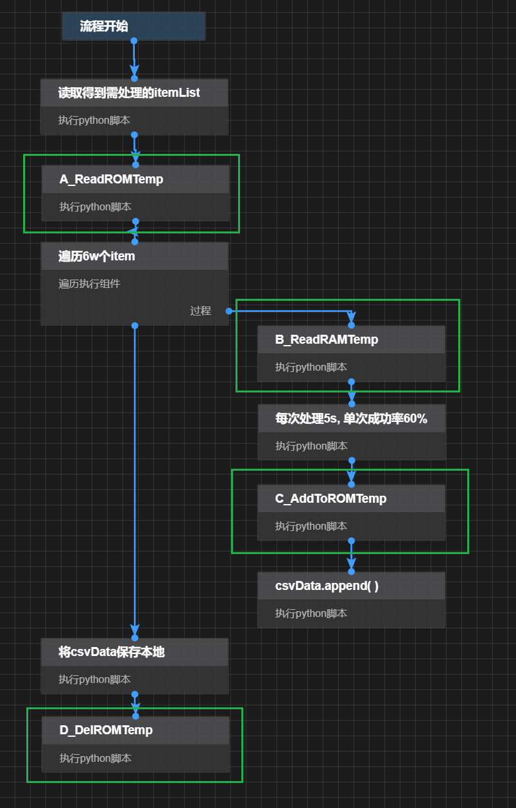
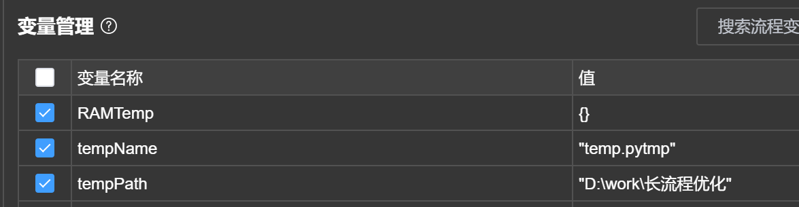
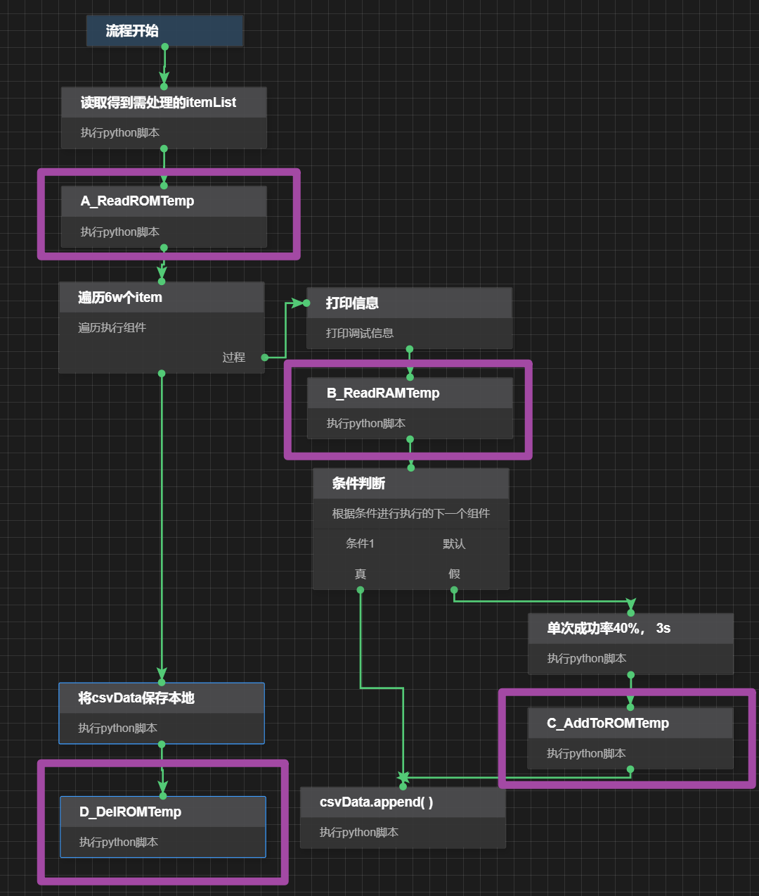

# 长遍历优化 - ErgodicTimeSaver
## 提出背景
有6w条数据需要使用IPA进行处理，但每条需5s处理时间，共需要84小时.
若在82小时内有中断，则整个流程进度清空，需要重新来过。即使每条处理99%的成功率，连续成功处理100次后，成功率也仅剩36%。

## 解决思路
- 断点续行：在遍历（Ergodic）内每次处理时，对处理后的数据进行Dump操作，进度文件（Temp）保存在硬盘（ROM）中，下次运行即可快速跳过已处理部分。
- 数据去重：重复遇到已处理后的数据，则通过内存（RAM）中快速得到已处理关键值的信息。

## 模块代码
主要分为4个步骤
- A_ReadROMTemp.py:
  - 遍历前读取硬盘进度缓存文件，并将遍历前已处理部分恢复
- B_ReadRAMTemp.py:
  - 遍历中每次处理新item时，从内存中查找曾处理过的部分，直接返回数据(0.1s)，而非再次处理(5s+)
- C_AddToROMTemp.py:
  - 遍历每次处理item后，将进度保存至硬盘&内存中；
- D_DelROMTemp.py:
  - 若此循环处理完成，删除本地的临时文件

## 测试代码
test/目录下,共有两个文件，模拟了ErgodicTimeSaver周期的两个测试用例
- lifeCycleTest1: 模拟了第一次程序运行的情况，遍历两次后中断
- lifeCycleTest2: 模拟了第二次程序运行的情况，读取硬盘缓存，直接跳过已处理部分，直至运行成功。

## 使用方式
1. 新增3个变量

2. codes文件夹下的四个模块代码，分别放在4个文件中
